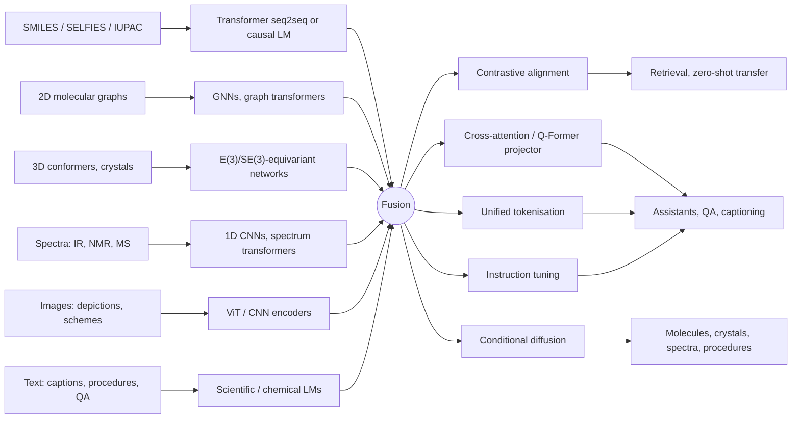
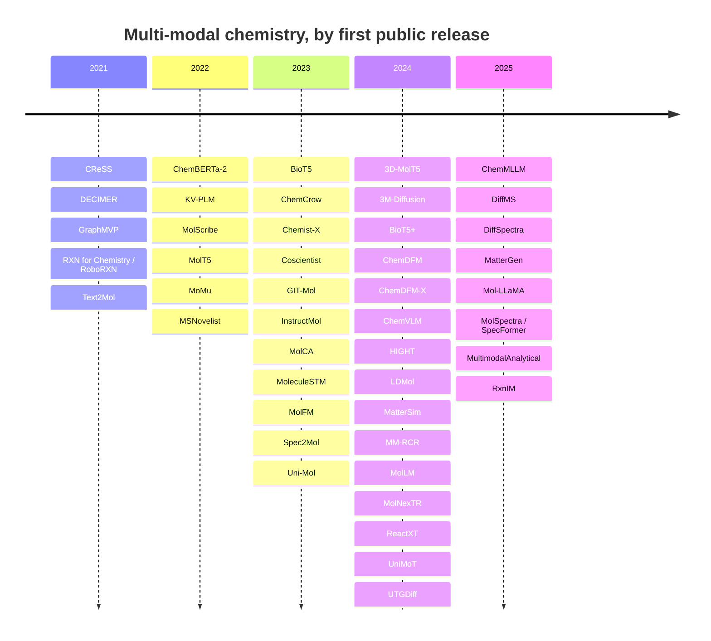

<div align="center">


<br>

[](https://awesome.re)
[](LICENSE)
[](CONTRIBUTING.md)
[](https://axelrolov.github.io/awesome-multimodal-chemistry/)
[](../../actions/workflows/links.yml)
[](../../stargazers)

**Models, datasets and benchmarks that learn across chemically meaningful modalities —
graphs, 3D structures, spectra, images, reactions and text.**

<!-- BEGIN:stats -->
**45** models and systems · **26** datasets and benchmarks · **21** surveys, critiques and governance references · **43/45** models with public code

<!-- END:stats -->

[**Browse the searchable site →**](https://axelrolov.github.io/awesome-multimodal-chemistry/) · [**Read the full review →**](REVIEW.md) · [**Contribute →**](CONTRIBUTING.md)

</div>

---

## Why this list

Most chemistry ML lists are organised by *task*. This one is organised by *what the model
can see*. That turns out to be the more useful axis: a model that reads only SMILES and a
model that reads SMILES, a conformer and an IR spectrum are not competing on the same
problem, even when they report the same benchmark number.

Every entry here was checked against its primary source. Scale figures are quoted from the
paper, not estimated. Where a paper reports no code, no licence or no parameter count, this
list says `unspecified` rather than guessing — because in this field the gaps are often the
most informative part.

The tables below are generated from [`data/*.yaml`](data/), so the machine-readable version
is the source of truth, not a byproduct.

## Contents

- [Scope and definitions](#scope-and-definitions)
- [The landscape at a glance](#the-landscape-at-a-glance)
- [Models and systems](#models-and-systems)
- [Datasets and benchmarks](#datasets-and-benchmarks)
- [Timeline](#timeline)
- [What actually works](#what-actually-works)
- [Open problems](#open-problems)
- [Reading list](#reading-list)
- [Contributing](#contributing)
- [Licence and citation](#licence-and-citation)

## Scope and definitions

A **multi-modal model in chemistry** is one that jointly learns from, aligns, or translates
between two or more chemically meaningful modalities:

| Modality | What it encodes | Typical encoder |
|---|---|---|
| `SMILES` `SELFIES` `IUPAC` | composition and connectivity, as a sequence | seq2seq or causal transformer |
| `graph` | explicit atom–bond topology | GNN, graph transformer |
| `3D` `crystal` | sterics, geometry, symmetry | E(3)/SE(3)-equivariant network |
| `IR` `NMR` `MS` | instrument signal, tightly coupled to structure | 1D CNN, spectrum transformer |
| `image` | how chemists actually communicate structures | ViT, CNN |
| `text` | descriptive, procedural and conceptual knowledge | scientific or chemical LM |
| `reaction` | roles, conditions, yields — symbolic *and* continuous | reaction-aware LM |
| `KG` | curated relational knowledge | graph attention over triples |

Two families are worth keeping apart:

- **Multi-view molecular modelling** combines alternative encodings of the *same* molecule
  (2D graph + 3D geometry). It buys physical fidelity and transfer on property tasks.
  → *GraphMVP, Uni-Mol, MolLM, 3D-MolT5, Mol-LLaMA*
- **Cross-domain multimodality** bridges structured chemical input with human- or
  instrument-generated signals (graph↔text, image↔structure, spectra↔structure). It buys
  new *tasks*: retrieval, captioning, document intelligence, elucidation, automation.
  → *MoleculeSTM, ChemVLM, RxnIM, DiffSpectra, ChemDFM-X*

The boundary between representation and generation is porous, so both are included here. A
contrastive encoder usually becomes the conditioning front-end of a generator; generative
pretraining usually yields reusable representations.

## The landscape at a glance



Five architectural families cover almost everything in this list:

| Family | Objective | Best at | Examples |
|---|---|---|---|
| **Dual-encoder contrastive** | InfoNCE-style alignment | retrieval, zero-shot transfer | MoMu, MoleculeSTM, MolFM, CReSS |
| **Encoder–decoder translator** | reconstruction / denoising | captioning, sequence generation | MolT5, BioT5, MSNovelist, Spec2Mol |
| **Projector-based MLLM** | instruction tuning on a frozen LM | broad assistant tasks | InstructMol, MolCA, ChemVLM, Mol-LLaMA |
| **Unified token model** | next-token prediction over mixed tokens | one stream, no modality boundary | UniMoT, 3D-MolT5, HIGHT |
| **Conditional diffusion** | denoising in latent, graph or 3D space | structured outputs with global coherence | 3M-Diffusion, LDMol, DiffMS, DiffSpectra, MatterGen |

## Models and systems

> Sorted by first public release within each group. `unspecified` means the source genuinely
> does not state it.

<!-- BEGIN:models -->
### Molecule ↔ Text

Contrastive alignment, translation and text-guided generation between molecular structure and natural language.

| Model | Year | Modalities | Paper | Code | Licence | Why it matters |
|---|:--:|---|---|---|---|---|
| **Text2Mol** | 2021 | `text` `SMILES` `graph` | [EMNLP 2021](https://aclanthology.org/2021.emnlp-main.47/) | [repo](https://github.com/cnedwards/text2mol) | unspecified | The paper that made molecule–language retrieval a task, and the origin of the ChEBI-20 benchmark. |
| **ChemBERTa-2** | 2022 | `SMILES` | [arXiv](https://arxiv.org/abs/2209.01712) | [repo](https://github.com/seyonechithrananda/bert-loves-chemistry) | MIT | Not multimodal itself, but the SMILES-encoder baseline most multimodal papers compare against. |
| **KV-PLM** | 2022 | `text` `SMILES` | [Nature Communications](https://doi.org/10.1038/s41467-022-28494-3) | [repo](https://github.com/thunlp/KV-PLM) | unspecified | Earliest unified SMILES + biomedical-text language model; sequence-only, no explicit structure. |
| **MolT5** | 2022 | `text` `SMILES` | [EMNLP 2022](https://arxiv.org/abs/2204.11817) | [repo](https://github.com/blender-nlp/MolT5) | BSD-3-Clause | Established molecule ↔ language translation as a benchmark family; still the default seq2seq baseline. |
| **MoMu** | 2022 | `text` `graph` | [arXiv](https://arxiv.org/abs/2209.05481) | [repo](https://github.com/BingSu12/MoMu) | non-commercial academic use | First contrastive graph–text foundation model; supervision harvested from paper text, so pairs are weak. |
| **BioT5** | 2023 | `text` `SMILES` | [EMNLP 2023](https://arxiv.org/abs/2310.07276) | [repo](https://github.com/QizhiPei/BioT5) | MIT | SELFIES-based T5 that fixes MolT5's invalid-output problem. |
| **MolCA** | 2023 | `graph` `text` `SMILES` | [EMNLP 2023](https://arxiv.org/abs/2310.12798) | [repo](https://github.com/acharkq/MolCA) | unspecified | The Q-Former-style projector that most later graph–LLM assistants reuse; ships PubChem324k. |
| **MoleculeSTM** | 2023 | `text` `graph` `SMILES` | [Nature Machine Intelligence](https://arxiv.org/abs/2212.10789) | [repo](https://github.com/chao1224/MoleculeSTM) | NVIDIA Source Code License (non-commercial) | Introduced open-vocabulary text-based molecule editing; dataset release constrained by text licensing. |
| **MolFM** | 2023 | `graph` `text` `KG` | [arXiv](https://arxiv.org/abs/2307.09484) | [repo](https://github.com/PharMolix/OpenBioMed) | MIT | Adds a knowledge graph as a third modality; +12.13 pp zero-shot cross-modal retrieval. |
| **3M-Diffusion** | 2024 | `text` `graph` | [COLM 2024](https://arxiv.org/abs/2403.07179) | [repo](https://github.com/huaishengzhu/3MDiffusion) | unspecified | Aligns a graph latent space to text, then diffuses in it — the first strong text→graph diffusion result. |
| **BioT5+** | 2024 | `text` `SMILES` | [Findings of ACL 2024](https://arxiv.org/abs/2402.17810) | [repo](https://github.com/QizhiPei/BioT5) | MIT | 15 task types over 21 datasets; first place in the ACL 2024 text-based molecule generation track. |
| **LDMol** | 2024 | `text` `SMILES` | [ICML 2025](https://arxiv.org/abs/2405.17829) | [repo](https://github.com/jinhojsk515/ldmol) | Apache-2.0 | Direct evidence that latent diffusion beats autoregressive decoding when the latent space is chemistry-aware. |
| **UTGDiff** | 2024 | `text` `graph` | [arXiv](https://arxiv.org/abs/2408.09896) | [repo](https://github.com/ran1812/UTGDiff) | unspecified | One denoising network over a joint text–graph token space rather than two aligned encoders. |

### Multi-View: 2D + 3D

Alternative encodings of the *same* molecule — graph topology fused with geometry.

| Model | Year | Modalities | Paper | Code | Licence | Why it matters |
|---|:--:|---|---|---|---|---|
| **GraphMVP** | 2021 | `graph` `3D` | [ICLR 2022](https://arxiv.org/abs/2110.07728) | [repo](https://github.com/chao1224/GraphMVP) | MIT | The canonical 2D↔3D multi-view pretraining recipe; 3D as a teacher for a 2D encoder. |
| **Uni-Mol** | 2023 | `3D` `graph` | [ICLR 2023](https://openreview.net/forum?id=6K2RM6wVqKu) | [repo](https://github.com/deepmodeling/Uni-Mol) | MIT | 209M conformations + 3M pockets; the 3D backbone that later multimodal assistants plug in. |
| **3D-MolT5** | 2024 | `3D` `text` `SMILES` | [ICLR 2025](https://arxiv.org/abs/2406.05797) | [repo](https://github.com/QizhiPei/3D-MolT5) | Apache-2.0 | Discretises 3D geometry into T5 tokens, so structure and language share one autoregressive stream. |
| **MolLM** | 2024 | `text` `graph` `3D` | [Bioinformatics (ISMB 2024)](https://doi.org/10.1093/bioinformatics/btae260) | [repo](https://github.com/gersteinlab/MolLM) | unspecified | Clean ablation showing what explicit 3D adds on top of graph–text contrastive pretraining. |
| **Mol-LLaMA** | 2025 | `graph` `3D` `text` | [NeurIPS 2025](https://arxiv.org/abs/2502.13449) | [repo](https://github.com/DongkiKim95/Mol-LLaMA) | unspecified | Blends 2D and 3D encoders through cross-attention before the Q-Former; 7B and 8B checkpoints released. |

### Multimodal LLMs & Assistants

Instruction-tuned models that inject structural embeddings into a language backbone.

| Model | Year | Modalities | Paper | Code | Licence | Why it matters |
|---|:--:|---|---|---|---|---|
| **GIT-Mol** | 2023 | `graph` `image` `text` `SMILES` | [Computers in Biology and Medicine](https://arxiv.org/abs/2308.06911) | [repo](https://github.com/AI-HPC-Research-Team/GIT-Mol) | MIT | First graph+image+text chemistry model; GIT-Former with cross-modal matching and contrastive losses. |
| **InstructMol** | 2023 | `graph` `text` `SMILES` | [COLING 2025](https://arxiv.org/abs/2311.16208) | [repo](https://github.com/IDEA-XL/InstructMol) | Apache-2.0 (code); CC BY-NC 4.0 (data) | Two-stage alignment + instruction tuning on a frozen LLM; the practical assistant template. |
| **ChemDFM** | 2024 | `text` `SMILES` | [Cell Reports Physical Science](https://arxiv.org/abs/2401.14818) | [repo](https://github.com/OpenDFM/ChemDFM) | Apache-2.0 | The text-only dialogue backbone that ChemDFM-X extends with modality encoders. |
| **ChemDFM-X** | 2024 | `graph` `3D` `image` `MS` `IR` `text` `SMILES` | [Science China Information Sciences](https://arxiv.org/abs/2409.13194) | [repo](https://github.com/OpenDFM/ChemDFM-X) | Apache-2.0 | The broadest modality coverage of any open chemistry model; 7.6M synthesised instruction pairs. |
| **HIGHT** | 2024 | `graph` `text` | [ICML 2025](https://arxiv.org/abs/2406.14021) | [repo](https://github.com/LFhase/HIGHT) | Apache-2.0 | Node-level tokenisation causes motif hallucination; hierarchical tokens cut it by 40% across 14 benchmarks. |
| **UniMoT** | 2024 | `graph` `text` `SMILES` | [IJCAI 2025](https://arxiv.org/abs/2408.00863) | — | unspecified | VQ-tokenises molecules into the LLM's own vocabulary; elegant unification, sparse public code. |
| **ChemMLLM** | 2025 | `image` `text` `SMILES` | [arXiv / Cell Reports Physical Science](https://arxiv.org/abs/2505.16326) | [repo](https://github.com/bbsbz/ChemMLLM) | unspecified | Understands *and* generates molecule images; 34B hits 0.87 avg sim on img2SMILES, 4.27 vs 1.97 over GPT-4o on image optimisation. |

### Images, OCR & Document Intelligence

Molecular depictions and reaction schemes as they actually appear in papers and patents.

| Model | Year | Modalities | Paper | Code | Licence | Why it matters |
|---|:--:|---|---|---|---|---|
| **DECIMER** | 2021 | `image` `SMILES` | [Journal of Cheminformatics](https://doi.org/10.1186/s13321-021-00538-8) | [repo](https://github.com/Kohulan/DECIMER-Image_Transformer) | MIT | Fully open OCSR pipeline with released training data; the other specialist baseline to beat. |
| **MolScribe** | 2022 | `image` `graph` | [J. Chem. Inf. Model.](https://arxiv.org/abs/2205.14311) | [repo](https://github.com/thomas0809/MolScribe) | MIT | The image-to-graph OCSR reference; explicit atoms and bonds with confidence estimates. |
| **ChemVLM** | 2024 | `image` `text` | [AAAI 2025](https://arxiv.org/abs/2408.07246) | [repo](https://github.com/lijunxian111/ChemVlm) | unspecified | InternViT-6B + ChemLLM-20B (26B total, 16×A100); SOTA on 5 of 6 tasks, 31.6% on CMMU vs 24.2% for GPT-4V. |
| **MolNexTR** | 2024 | `image` `graph` | [Journal of Cheminformatics](https://arxiv.org/abs/2403.03691) | [repo](https://github.com/CYF2000127/MolNexTR) | Apache-2.0 | ConvNext+ViT dual stream; one of the specialists that generalist MLLMs still have not caught. |
| **RxnIM** | 2025 | `image` `reaction` `text` | [Chemical Science](https://arxiv.org/abs/2503.08156) | [repo](https://github.com/CYF2000127/RxnIM) | MIT | Turns published reaction schemes into machine-readable records; 88% average F1, ~5 pts over prior baselines. |

### Reactions, Conditions & Procedures

Reaction context, condition recommendation and experimental procedure prediction.

| Model | Year | Modalities | Paper | Code | Licence | Why it matters |
|---|:--:|---|---|---|---|---|
| **MM-RCR** | 2024 | `reaction` `graph` `text` `SMILES` | [arXiv (also released as Chemma-RC)](https://arxiv.org/abs/2407.15141) | — | unspecified | 1.2M pairwise QA instructions; the clearest treatment of reaction conditions as a first-class modality. |
| **ReactXT** | 2024 | `reaction` `graph` `text` `SMILES` | [Findings of ACL 2024](https://arxiv.org/abs/2405.14225) | [repo](https://github.com/syr-cn/ReactXT) | MIT | Role-aware forward/backward reaction context as a pretraining signal; ships the OpenExp dataset. |

### Spectra & Structure Elucidation

IR, NMR and MS as model inputs — retrieval, interpretation and de novo generation.

| Model | Year | Modalities | Paper | Code | Licence | Why it matters |
|---|:--:|---|---|---|---|---|
| **CReSS** | 2021 | `NMR` `SMILES` | [Analytical Chemistry](https://doi.org/10.1021/acs.analchem.1c04307) | [repo](https://github.com/Qihoo360/CReSS) | unspecified | CLIP-style contrastive alignment applied to 13C NMR — the spectroscopy analogue of MoleculeSTM. |
| **MSNovelist** | 2022 | `MS` `SMILES` | [Nature Methods](https://doi.org/10.1038/s41592-022-01486-3) | [repo](https://github.com/zamboni-lab/MSNovelist) | AGPL-3.0 | Fingerprint prediction then RNN decoding; the first credible non-retrieval answer to unknown MS/MS. |
| **Spec2Mol** | 2023 | `MS` `SMILES` | [Communications Chemistry](https://doi.org/10.1038/s42004-023-00932-3) | [repo](https://github.com/KavrakiLab/Spec2Mol) | BSD-3-Clause | Straight spectra→SMILES encoder–decoder; the simplest baseline the diffusion models are measured against. |
| **DiffMS** | 2025 | `MS` `graph` | [ICML 2025](https://arxiv.org/abs/2502.09571) | [repo](https://github.com/coleygroup/DiffMS) | MIT | Formula-constrained graph diffusion conditioned on MS/MS; the strongest MS-only generative baseline. |
| **DiffSpectra** | 2025 | `IR` `NMR` `MS` `graph` `3D` | [arXiv](https://arxiv.org/abs/2507.06853) | [repo](https://github.com/AzureLeon1/DiffSpectra) | Apache-2.0 | SpecFormer conditioning an SE(3)-equivariant diffusion transformer; 40.76% top-1 and 99.49% top-10. |
| **MolSpectra / SpecFormer** | 2025 | `IR` `NMR` `3D` | [ICLR 2025](https://arxiv.org/abs/2502.16284) | [repo](https://github.com/AzureLeon1/MolSpectra) | unspecified | Uses energy spectra as a physical supervision signal for 3D encoders, not just as a retrieval query. |
| **MultimodalAnalytical** | 2025 | `IR` `NMR` `MS` `SMILES` | [ChemRxiv / AI4Mat @ NeurIPS 2025](https://doi.org/10.26434/chemrxiv-2025-q80r9) | [repo](https://github.com/rxn4chemistry/MultimodalAnalytical) | MIT | Analytical chemistry consolidating into reusable foundation-model tooling rather than one-off models. |

### Materials & Crystals

Property-conditioned generation and simulation of inorganic solids.

| Model | Year | Modalities | Paper | Code | Licence | Why it matters |
|---|:--:|---|---|---|---|---|
| **MatterSim** | 2024 | `crystal` `3D` | [arXiv](https://arxiv.org/abs/2405.04967) | [repo](https://github.com/microsoft/mattersim) | MIT | The forward simulator that pairs with MatterGen to close the generate-then-verify loop. |
| **MatterGen** | 2025 | `crystal` `3D` | [Nature](https://doi.org/10.1038/s41586-025-08628-5) | [repo](https://github.com/microsoft/mattergen) | MIT | Joint diffusion over atom types, coordinates and lattice; fine-tunable on property constraints. |

### Agents & Lab Automation

Tool-augmented systems that act on chemical information rather than only describing it.

| Model | Year | Modalities | Paper | Code | Licence | Why it matters |
|---|:--:|---|---|---|---|---|
| **RXN for Chemistry / RoboRXN** | 2021 | `reaction` `text` | [Nature Communications](https://doi.org/10.1038/s41467-021-22951-1) | [repo](https://github.com/rxn4chemistry/rxn4chemistry) | MIT | Reaction SMILES → machine-readable action sequences → a robot that actually runs them. |
| **ChemCrow** | 2023 | `text` | [Nature Machine Intelligence](https://doi.org/10.1038/s42256-024-00832-8) | [repo](https://github.com/ur-whitelab/chemcrow-public) | MIT | 18 expert tools behind an LLM; the reference point for tool-augmented rather than end-to-end multimodality. |
| **Chemist-X** | 2023 | `text` `reaction` | [arXiv](https://arxiv.org/abs/2311.10776) | [repo](https://github.com/Nikki0526/ChemistX) | MIT | RAG-style agent over reaction databases with wet-lab control in the loop. |
| **Coscientist** | 2023 | `text` `image` | [Nature](https://doi.org/10.1038/s41586-023-06792-0) | [repo](https://github.com/gomesgroup/coscientist) | Apache-2.0 with Commons Clause | GPT-4 with search, code execution and robotic execution; planned and ran real reactions. |

<!-- END:models -->

## Datasets and benchmarks

<!-- BEGIN:datasets -->
| Dataset | Year | Type | Modalities | Scale | Licence | Paper | Data |
|---|:--:|---|---|---|---|---|---|
| **Materials Project** | 2013 | Corpus | `crystal` `3D` | 86,680 inorganic compounds and 530,243 nanoporous materials (live) | CC BY 4.0 | [paper](https://doi.org/10.1063/1.4812323) | [download](https://materialsproject.org/) |
| **QM9** | 2014 | Benchmark | `3D` | 133,885 species with up to nine heavy atoms, 15 DFT properties | CC BY-NC-SA 4.0 | [paper](https://doi.org/10.1038/sdata.2014.22) | [download](https://doi.org/10.6084/m9.figshare.978904) |
| **USPTO-50k** | 2016 | Benchmark | `reaction` | 50k reactions of 10 types; 40,008 / 5,001 / 5,007 split | unspecified | [paper](https://doi.org/10.1021/acs.jcim.6b00564) | [download](https://github.com/Hanjun-Dai/GLN) |
| **MoleculeNet** | 2018 | Benchmark | `SMILES` `graph` `3D` | 17 datasets, >800 tasks over ~700,000 compounds | CC BY-NC 3.0 | [paper](https://doi.org/10.1039/C7SC02664A) | [download](https://github.com/deepchem/deepchem) |
| **Alchemy** | 2019 | Benchmark | `3D` | 119,487 molecules up to 14 heavy atoms, 12 quantum properties | MIT | [paper](https://arxiv.org/abs/1906.09427) | [download](https://github.com/tencent-alchemy/Alchemy) |
| **USPTO-full** | 2019 | Benchmark | `reaction` | ~1M unique reactions, 800k / 100k / 100k split | unspecified | [paper](https://arxiv.org/abs/2001.01408) | [download](https://doi.org/10.6084/m9.figshare.5104873) |
| **ChEBI-20** | 2021 | Benchmark | `SMILES` `text` | 33,010 molecule–description pairs, 80/10/10 split | unspecified | [paper](https://doi.org/10.18653/v1/2021.emnlp-main.47) | [download](https://github.com/cnedwards/text2mol) |
| **Open Reaction Database (ORD)** | 2021 | Corpus | `reaction` `text` | structured reaction records with conditions, yields and free-text procedures | CC BY-SA 4.0 | [paper](https://doi.org/10.1021/jacs.1c09820) | [download](https://huggingface.co/datasets/open-reaction-database/ord-data) |
| **PCQM4Mv2 / OGB-LSC** | 2021 | Benchmark | `graph` `3D` | 3,746,619 molecules with DFT HOMO–LUMO gaps | CC BY 4.0 | [paper](https://arxiv.org/abs/2103.09430) | [download](https://ogb.stanford.edu/docs/lsc/pcqm4mv2/) |
| **GEOM** | 2022 | Corpus | `3D` | 37M conformations for >450,000 molecules | CC0 | [paper](https://doi.org/10.1038/s41597-022-01288-4) | [download](https://doi.org/10.7910/DVN/JNGTDF) |
| **ChEMBL** | 2023 | Corpus | `SMILES` `text` | >20.3M bioactivity measurements on 2.4M compounds from >1.6M assays | CC BY-SA 3.0 | [paper](https://doi.org/10.1093/nar/gkad1004) | [download](https://ftp.ebi.ac.uk/pub/databases/chembl/ChEMBLdb/latest/) |
| **PubChem324k** | 2023 | Pretraining set | `graph` `SMILES` `text` | 324k molecule–text pairs; 15k high-quality subset (>19 words) | unspecified | [paper](https://aclanthology.org/2023.emnlp-main.966/) | [download](https://huggingface.co/datasets/acharkq/PubChem324kV2) |
| **PubChemSTM** | 2023 | Pretraining set | `graph` `SMILES` `text` | >280,000 structure–text pairs | unspecified | [paper](https://arxiv.org/abs/2212.10789) | [download](https://huggingface.co/datasets/chao1224/MoleculeSTM) |
| **MassSpecGym** | 2024 | Benchmark | `MS` `SMILES` | 231k high-quality spectra over 29k unique structures | MIT | [paper](https://arxiv.org/abs/2410.23326) | [download](https://huggingface.co/datasets/roman-bushuiev/MassSpecGym) |
| **MMChemOCR / MMCR-Bench / MMChemBench** | 2024 | Benchmark | `image` `text` `SMILES` | 1,000 OCR pairs; 1,000 exam questions; 700 captioning/property samples | MIT | [paper](https://arxiv.org/abs/2408.07246) | [download](https://huggingface.co/datasets/Duke-de-Artois/ChemVLM_test_data) |
| **Mol-Instructions** | 2024 | Instruction set | `SMILES` `text` | 148.4K molecule, 505K protein and 53K biotext instructions | CC BY 4.0 | [paper](https://arxiv.org/abs/2306.08018) | [download](https://huggingface.co/datasets/zjunlp/Mol-Instructions) |
| **MolLM dataset** | 2024 | Pretraining set | `graph` `3D` `text` | 160K molecule–text pairings with 2D and 3D information | unspecified | [paper](https://doi.org/10.1093/bioinformatics/btae260) | [download](https://github.com/gersteinlab/MolLM) |
| **MolPuzzle** | 2024 | Benchmark | `IR` `MS` `NMR` `image` `text` | 217 instances, 868 spectrum images, 23,678 QA samples | MIT | [paper](https://proceedings.neurips.cc/paper_files/paper/2024/hash/f2b9e8e7a36d43ddfd3d55113d56b1e0-Abstract-Datasets_and_Benchmarks_Track.html) | [download](https://huggingface.co/datasets/kguo2/MolPuzzle_data) |
| **Multimodal Spectroscopic Dataset** | 2024 | Corpus | `NMR` `IR` `MS` `SMILES` | 1H/13C/HSQC NMR, IR and ±MS for 790,000 patent-derived molecules | CDLA-Sharing-1.0 | [paper](https://arxiv.org/abs/2407.17492) | [download](https://doi.org/10.5281/zenodo.14770232) |
| **OpenExp** | 2024 | Benchmark | `reaction` `text` | 274k reaction–procedure pairs, 8:1:1 split | CC BY-SA | [paper](https://arxiv.org/abs/2405.14225) | [download](https://github.com/syr-cn/ReactXT) |
| **ORDerly** | 2024 | Benchmark | `reaction` | 356,906 reactions in the condition-prediction benchmark, from 1.7M ORD reactions | MIT | [paper](https://doi.org/10.1021/acs.jcim.4c00292) | [download](https://figshare.com/articles/dataset/ORDerly_chemical_reactions_condition_benchmarks/23298467) |
| **HiPubChem** | 2025 | Pretraining set | `graph` `text` | 295k molecule–text pairs with motif annotations (Jan 2024 cutoff) | CC BY-NC 4.0 | [paper](https://arxiv.org/abs/2406.14021) | [download](https://huggingface.co/datasets/lfhase/HIGHT) |
| **IR–NMR multimodal dataset** | 2025 | Corpus | `IR` `NMR` `3D` `SMILES` | 177,461 molecules with IR; 1,255 with DFT 1H/13C shifts | CDLA-Permissive-2.0 | [paper](https://doi.org/10.1038/s41597-025-05729-8) | [download](https://doi.org/10.5281/zenodo.15669241) |
| **MaCBench** | 2025 | Benchmark | `image` `text` `crystal` | 1,153 expert-curated questions across 35 configurations | MIT | [paper](https://doi.org/10.1038/s43588-025-00836-3) | [download](https://huggingface.co/datasets/jablonkagroup/MaCBench) |
| **MotifHallu** | 2025 | Benchmark | `graph` `text` | 23,924 questions over 3,300 molecules and 38 RDKit functional groups | CC BY-NC 4.0 | [paper](https://arxiv.org/abs/2406.14021) | [download](https://huggingface.co/datasets/lfhase/HIGHT) |
| **PubChem** | 2025 | Corpus | `SMILES` `graph` `3D` `text` | 118.6M compounds, 322.4M substances, 295.4M bioactivity data points (Sep 2024) | unspecified | [paper](https://doi.org/10.1093/nar/gkae1059) | [download](https://pubchem.ncbi.nlm.nih.gov/docs/downloads) |

<!-- END:datasets -->

## Timeline

<!-- BEGIN:timeline -->


<!-- END:timeline -->

## What actually works

Findings below are drawn from the papers indexed above; the [full review](REVIEW.md) carries
the argument and the numbers.

<details open>
<summary><b>Specialists still beat generalists on tightly-scoped tasks</b></summary>

<br>

On strict image-to-structure conversion, MolScribe, MolNexTR and DECIMER remain ahead of
generalist multimodal LLMs. ChemMLLM and ChemVLM narrow the gap and cover far more tasks,
but if you need one number to be right, use the specialist. MaCBench makes the same point
from the evaluation side: vision-language models perceive chemistry images competently and
then fail at spatial reasoning and cross-modal synthesis.

</details>

<details>
<summary><b>Modalities help when they are complementary, not redundant</b></summary>

<br>

3D geometry helps when the target is physically grounded (quantum properties, binding).
Text helps when the target depends on assay context, semantics or biochemical description.
Stacking two encodings of the same information mostly buys parameters. MolLM's ablations
and the GraphMVP line of work are the cleanest evidence here.

</details>

<details>
<summary><b>Tokenisation design drives chemical hallucination</b></summary>

<br>

HIGHT showed that node-centric graph tokenisation induces *motif* hallucination — models
confidently assert functional groups that are not present — and that a chemically meaningful
token hierarchy cuts it by 40% while improving 14 benchmarks. This is a design bug, not a
scale problem.

</details>

<details>
<summary><b>Spectroscopy is where multimodality is chemically necessary, not merely convenient</b></summary>

<br>

Human experts elucidate structures by combining orthogonal evidence streams, and the models
now do the same. DiffSpectra reports 40.76% top-1 and 99.49% top-10 structure elucidation
accuracy by conditioning an SE(3)-equivariant diffusion transformer on multiple spectra at
once — a regime that single-modality models such as MSNovelist and Spec2Mol could not reach.

</details>

<details>
<summary><b>Reaction work is consolidating into a pipeline, not competing models</b></summary>

<br>

RxnIM parses published reaction schemes into machine-readable records; ReactXT uses reaction
context to predict procedures and retrosynthetic routes; MM-RCR recommends conditions; RXN
for Chemistry executes them on hardware. These are stages of one stack, and they are
increasingly being built as such.

</details>

<details>
<summary><b>Diffusion is winning wherever the output is a structured object</b></summary>

<br>

For molecules, crystals and spectra alike, denoising in a chemically meaningful latent or
geometric space now matches or beats autoregressive decoding — LDMol, 3M-Diffusion, DiffMS,
DiffSpectra and MatterGen all point the same way. Autoregression still owns text output.

</details>

## Open problems

| # | Problem | Why it is hard | Where to look |
|:--:|---|---|---|
| 1 | **Paired-data scarcity** | There is no chemistry equivalent of a web-scale image–text corpus. Molecule–text sets are in the 10⁵ range; genuinely aligned all-modal corpora barely exist. | ChemDFM-X synthesises 7.6M instructions; most others use two-stage training on frozen backbones |
| 2 | **Data rights and reproducibility** | PubChem is permissive but its *textual* annotations inherit heterogeneous licences — which is why PubChemSTM could not be fully released. InstructMol's code is Apache-2.0 while its data is research-only. | [MoleculeSTM](https://arxiv.org/abs/2212.10789), [OECD data governance](https://www.oecd.org/en/publications/ai-data-governance-and-privacy_2476b1a4-en.html) |
| 3 | **Benchmark fragility** | Cleaning choices silently inflate reaction-condition scores; USPTO random splits are in-distribution; the same molecule recurs across literature, patents, images and derived synthetic data, so leakage is compounded. | [ORDerly](https://pubs.acs.org/doi/10.1021/acs.jcim.4c00292), [syntheseus](https://pubs.rsc.org/en/content/articlelanding/2025/fd/d4fd00093e), [OOD splits](https://pubs.acs.org/doi/10.1021/acscentsci.5c00055) |
| 4 | **Compute concentration** | ChemVLM: 26B params on 16×A100. Uni-Mol2: 1.1B params, 800M conformers. Frontier work increasingly means *adapting* someone else's large backbone. | Parameter-efficient projectors are the field's answer |
| 5 | **Cross-modal consistency** | Many models align modalities; few can guarantee that a generated molecule, its IR spectrum, its NMR features, its depiction and its verbal description all cohere physically. | The clearest unsolved problem in the field |
| 6 | **Dual use** | Generative molecular models can be inverted toward harmful design. This is demonstrated, not hypothetical. | [Urbina et al. 2022](https://www.nature.com/articles/s42256-022-00465-9), [EU AI Act Ch. V](https://eur-lex.europa.eu/eli/reg/2024/1689/oj/eng), [NIST AI RMF](https://www.nist.gov/publications/artificial-intelligence-risk-management-framework-ai-rmf-10) |

## Reading list

<!-- BEGIN:reading -->
### Surveys & reviews

- **[A Perspective on Foundation Models in Chemistry](https://pubs.acs.org/doi/10.1021/jacsau.4c01160)** — Junyoung Choi et al., *JACS Au* (2025).  
  Defines what actually qualifies as a chemistry foundation model, and where multimodal pretraining does not transfer.
- **[A Survey of Large Language Models for Text-Guided Molecular Discovery](https://arxiv.org/abs/2505.16094)** — Ziqing Wang et al., *arXiv* (2025).  
  Focused on language-conditioned molecule generation and optimisation.
- **[A review of large language models and autonomous agents in chemistry](https://pubs.rsc.org/en/content/articlelanding/2025/sc/d4sc03921a)** — Mayk Caldas Ramos et al., *Chemical Science* (2025).  
  The reference review for chemistry LLM agents and tool use, with a maintained companion repository.
- **[Advancements in Molecular Property Prediction: A Survey of Single and Multimodal Approaches](https://arxiv.org/abs/2408.09461)** — Tanya Liyaqat et al., *Archives of Computational Methods in Engineering* (2025).  
  Directly contrasts single-modality against multi-view encoders for property prediction.
- **[Artificial Intelligence in Spectroscopy: Advancing Chemistry from Prediction to Generation and Beyond](https://arxiv.org/abs/2502.09897)** — Kehan Guo et al., *IJCAI 2025 Survey Track* (2025).  
  Best current survey for AI-driven structure elucidation across MS, NMR and IR.
- **[From Generalist to Specialist: A Survey of Large Language Models for Chemistry](https://arxiv.org/abs/2412.19994)** — Yang Han et al., *COLING 2025* (2025).  
  Explicitly frames how graphs, 3D structures and spectra get injected into chemistry LLMs, plus a benchmark audit.
- **[Molecular representation learning: cross-domain foundations and future frontiers](https://pubs.rsc.org/en/content/articlelanding/2025/dd/d5dd00170f)** — Rahul Sheshanarayana, Fengqi You, *Digital Discovery* (2025).  
  Flags hybrid multimodal fusion and 3D-aware representations as the main open frontiers.
- **[A Comprehensive Survey of Scientific Large Language Models and Their Applications in Scientific Discovery](https://arxiv.org/abs/2406.10833)** — Yu Zhang et al., *arXiv* (2024).  
  Situates molecule, protein and material LLMs relative to text-only scientific models.
- **[Bridging Text and Molecule: A Survey on Multimodal Frameworks for Molecule](https://arxiv.org/abs/2403.13830)** — Yi Xiao et al., *arXiv* (2024).  
  Organises molecule–text models by pretraining objective, alignment strategy and downstream task.
- **[From Words to Molecules: A Survey of Large Language Models in Chemistry](https://arxiv.org/abs/2402.01439)** — Chang Liao et al., *arXiv* (2024).  
  Early systematic taxonomy of molecular input representations for LLMs.
- **[Leveraging Biomolecule and Natural Language through Multi-Modal Learning: A Survey](https://arxiv.org/abs/2403.01528)** — Qizhi Pei et al., *arXiv* (2024).  
  The most complete map of biomolecule–text cross-modal modelling, covering molecules, proteins and the datasets that join them to language.
- **[Materials science in the era of large language models: a perspective](https://pubs.rsc.org/en/content/articlelanding/2024/dd/d4dd00074a)** — Ge Lei, Ronan Docherty, Samuel J. Cooper, *Digital Discovery* (2024).  
  Argues LLMs are best used as tireless task automators rather than idea generators.

### Critical evaluations & benchmark hygiene

- **[A framework for evaluating the chemical knowledge and reasoning abilities of large language models against the expertise of chemists](https://www.nature.com/articles/s41557-025-01815-x)** — Adrian Mirza et al., *Nature Chemistry* (2025).  
  ChemBench — models beat expert chemists on average yet fail on safety-relevant items and are badly calibrated.
- **[Challenging Reaction Prediction Models to Generalize to Novel Chemistry](https://pubs.acs.org/doi/10.1021/acscentsci.5c00055)** — John Bradshaw et al., *ACS Central Science* (2025).  
  Random splits of USPTO-style data are in-distribution; proposes document, author, time and reaction-type OOD splits.
- **[Probing the limitations of multimodal language models for chemistry and materials research](https://www.nature.com/articles/s43588-025-00836-3)** — Nawaf Alampara et al., *Nature Computational Science* (2025).  
  MaCBench — perception is fine, spatial reasoning and cross-modal synthesis are not.
- **[Re-evaluating retrosynthesis algorithms with syntheseus](https://pubs.rsc.org/en/content/articlelanding/2025/fd/d4fd00093e)** — Krzysztof Maziarz et al., *Faraday Discussions* (2025).  
  Published retrosynthesis rankings largely dissolve once search and evaluation are standardised.
- **[ORDerly: Data Sets and Benchmarks for Chemical Reaction Data](https://pubs.acs.org/doi/10.1021/acs.jcim.4c00292)** — Daniel S. Wigh et al., *J. Chem. Inf. Model.* (2024).  
  Undisclosed cleaning choices silently inflate reported reaction-condition performance.

### Safety, dual use & governance

- **[AI, data governance and privacy: Synergies and areas of international co-operation](https://www.oecd.org/en/publications/ai-data-governance-and-privacy_2476b1a4-en.html)** — OECD, *OECD Artificial Intelligence Papers* (2024).  
  Reference statement on data governance, relevant to provenance and licensing of chemical corpora.
- **[Regulation (EU) 2024/1689 — Artificial Intelligence Act](https://eur-lex.europa.eu/eli/reg/2024/1689/oj/eng)** — European Parliament and Council, *EUR-Lex* (2024).  
  Binding source text for general-purpose AI provider obligations (Chapter V, Arts. 51–56).
- **[Artificial Intelligence Risk Management Framework (AI RMF 1.0)](https://www.nist.gov/publications/artificial-intelligence-risk-management-framework-ai-rmf-10)** — NIST, *NIST AI 100-1* (2023).  
  The Govern/Map/Measure/Manage framework most chemistry-AI risk policies are written against.
- **[Dual use of artificial-intelligence-powered drug discovery](https://www.nature.com/articles/s42256-022-00465-9)** — Fabio Urbina, Filippa Lentzos, Cédric Invernizzi, Sean Ekins, *Nature Machine Intelligence* (2022).  
  Inverting a toxicity model turns a generative drug-design pipeline into a toxin-design pipeline.

<!-- END:reading -->

## Contributing

Contributions are very welcome — especially corrections. See [CONTRIBUTING.md](CONTRIBUTING.md).

The short version: **edit the YAML, not the README.** The tables are generated.

```bash
pip install pyyaml
$EDITOR data/models.yaml          # or datasets.yaml / reading.yaml
python scripts/build.py           # regenerates README.md and docs/index.html
```

CI checks that the generated files are in sync and that every URL still resolves.

## Licence and citation

This list is released under [CC0 1.0](LICENSE) — public domain. The linked papers, code and
datasets remain under their own licences, which are recorded in the tables above; check them
before use, particularly the non-commercial ones.

```bibtex
@misc{awesome_multimodal_chemistry,
  title        = {Awesome Multi-Modal Chemistry},
  author       = {Orlov, Axel and contributors},
  year         = {2026},
  howpublished = {\url{https://github.com/AxelRolov/awesome-multimodal-chemistry}}
}
```

<div align="center">
<br>
<sub>If a paper is missing, mis-tagged, or its number is wrong — <a href="../../issues/new/choose">open an issue</a>. Corrections are the point.</sub>
</div>
