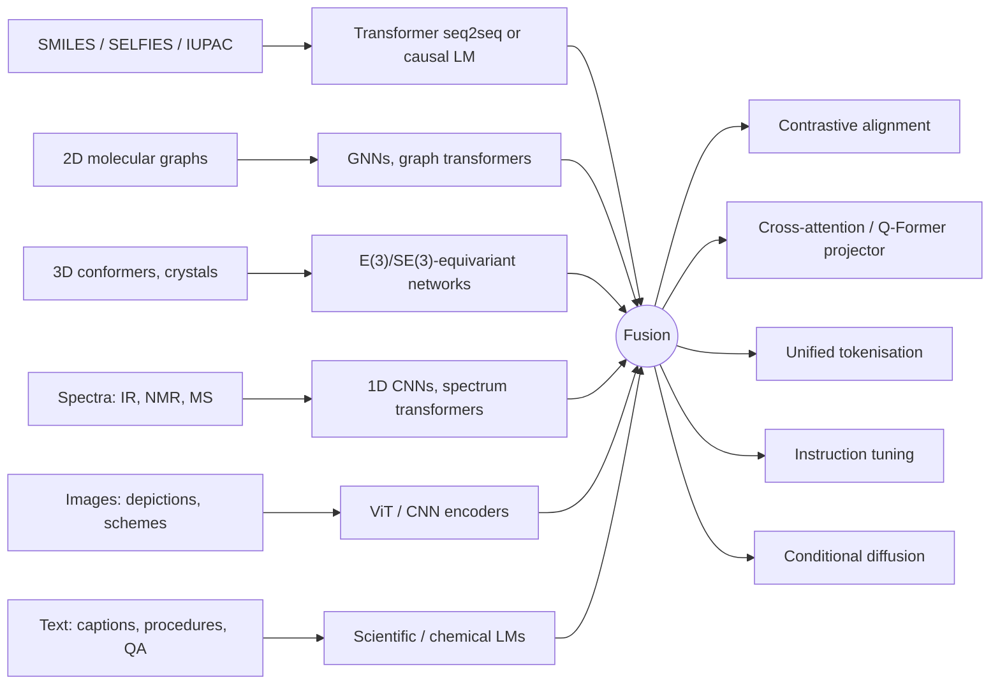

# Multi-Modal Models in Chemistry — a review

> The narrative companion to the [index](README.md). Every model, dataset and benchmark
> named here is linked; the machine-readable version lives in [`data/`](data/).

## Contents

- [Executive summary](#executive-summary)
- [Scope and definitions](#scope-and-definitions)
- [Modalities, architectures and learning objectives](#modalities-architectures-and-learning-objectives)
- [Data regimes, datasets and benchmarks](#data-regimes-datasets-and-benchmarks)
- [Applications and empirical patterns](#applications-and-empirical-patterns)
- [Limitations, compute and governance](#limitations-compute-and-governance)
- [Outlook](#outlook)

---

## Executive summary

Multi-modal modelling in chemistry has moved from early bimodal molecule–text systems such
as [KV-PLM](https://doi.org/10.1038/s41467-022-28494-3),
[MoMu](https://arxiv.org/abs/2209.05481), [MolT5](https://arxiv.org/abs/2204.11817) and
[MoleculeSTM](https://arxiv.org/abs/2212.10789) towards broader foundation models that
integrate graphs, 3D conformers, spectra, images, reaction context and natural language.
The current frontier includes domain-specific multimodal LLMs such as
[ChemVLM](https://arxiv.org/abs/2408.07246),
[ChemDFM-X](https://arxiv.org/abs/2409.13194) and
[ChemMLLM](https://arxiv.org/abs/2505.16326); structure-aware graph–language models such as
[HIGHT](https://arxiv.org/abs/2406.14021) and
[Mol-LLaMA](https://arxiv.org/abs/2502.13449); and modality-specialist generators such as
[DiffSpectra](https://arxiv.org/abs/2507.06853) for multimodal spectroscopy,
[RxnIM](https://arxiv.org/abs/2503.08156) for reaction-image parsing, and
[MatterGen](https://doi.org/10.1038/s41586-025-08628-5) for property-conditioned crystal
generation.

The field now has two distinct centres of gravity. The first is **representation learning**,
where the aim is to align or fuse modalities into transferable embeddings for retrieval,
captioning, property prediction, reaction tasks or question answering. Here, contrastive
learning, dual encoders, graph neural networks, Q-Former-style alignment and hierarchical
tokenisation dominate. The second is **generation**, where models translate from text, images
or spectra to molecules, procedures or materials, and where diffusion models, latent-variable
models and autoregressive transformers are increasingly competitive.

The strongest empirical results so far are task-dependent rather than universal.

- For **image understanding and OCR-style tasks**, specialists such as
  [MolScribe](https://arxiv.org/abs/2205.14311),
  [MolNexTR](https://arxiv.org/abs/2403.03691) and
  [DECIMER](https://doi.org/10.1186/s13321-021-00538-8) still outperform generalist
  multimodal LLMs, although ChemMLLM, ChemVLM and RxnIM narrow the gap and offer far broader
  task coverage.
- For **molecule–text retrieval and captioning**, MoleculeSTM,
  [MolFM](https://arxiv.org/abs/2307.09484), HIGHT and Mol-LLaMA show that chemically
  informed fusion beats generic vision-language transfer.
- For **reaction procedure and condition tasks**,
  [ReactXT](https://arxiv.org/abs/2405.14225) and
  [MM-RCR](https://arxiv.org/abs/2407.15141) show clear benefits from including reaction
  context or reaction text.
- For **spectroscopy**, recent multimodal datasets and models have shifted the area from
  retrieval-only pipelines towards de novo generation, with DiffSpectra reporting 40.76%
  top-1 and 99.49% top-10 structure elucidation accuracy.

The main bottlenecks are not architectural alone. They are also about data quality, data
rights, paired-modality scarcity, benchmark design and compute. Public multi-modal chemistry
corpora remain much smaller and more weakly curated than general web multimodal corpora; some
influential datasets cannot be fully released because of licensing on the textual side;
reaction benchmarks are highly sensitive to cleaning choices; and large multimodal models
increasingly inherit the governance obligations now associated with general-purpose AI
systems. In chemistry specifically, dual-use risk is not theoretical: generative molecular
models can be repurposed for harmful design tasks if safeguards are absent
([Urbina et al., 2022](https://www.nature.com/articles/s42256-022-00465-9)).

## Scope and definitions

In this review, a **multi-modal model in chemistry** means a model or integrated system that
either jointly learns from, aligns, or translates between two or more chemically meaningful
modalities. Those modalities include symbolic strings such as SMILES or SELFIES, atom–bond
graphs, 3D coordinates or conformers, spectra, molecular depictions or reaction figures,
natural language, structured reaction roles and conditions, and in some cases external
knowledge graphs or robot-tool interfaces. This definition intentionally includes both
**representation models** and **generation models**, because the literature now treats
alignment, retrieval, editing and conditional generation as a connected design space rather
than isolated tasks.

A useful distinction is between **multi-view molecular modelling** and **cross-domain
multimodality**. Multi-view molecular models combine alternative encodings of the same
molecule, most commonly 2D graphs and 3D geometry, as in
[GraphMVP](https://arxiv.org/abs/2110.07728),
[Uni-Mol](https://openreview.net/forum?id=6K2RM6wVqKu) and Mol-LLaMA. Cross-domain multimodal
models instead bridge chemically structured inputs with human-readable or
instrument-generated signals, such as graph–text, image–text, spectra–structure or
reaction–procedure models. The former usually improves physical fidelity and transfer on
property tasks; the latter expands the set of tasks that can be performed in natural
language, document intelligence, reasoning, or automated experimentation.

Representation models are best understood as learning a shared or comparable latent space
that supports zero-shot retrieval, property prediction, question answering, descriptor
transfer or reaction understanding. Generation models go further: they emit a molecule,
caption, edit, procedure, reaction condition set, spectrum, image or crystal structure
conditioned on one or more other modalities. In chemistry, the boundary is porous. A
contrastive encoder often becomes the conditioning front-end of a generator; conversely,
generative pretraining often yields reusable representations.

## Modalities, architectures and learning objectives

The modal taxonomy now used in chemistry has an unusually strong semantic hierarchy.

- **SMILES, SELFIES and IUPAC names** encode composition and connectivity in a sequence form
  suited to language modelling.
- **Graphs** preserve explicit atom–bond topology.
- **3D conformers and crystal structures** expose sterics, geometry and symmetry, which are
  crucial for quantum, binding and materials tasks.
- **Spectra** such as IR, NMR and MS/MS are instrument signals, often high-dimensional and
  noisy, but tightly linked to structure.
- **Images** capture human communication artefacts such as molecular drawings and reaction
  schemes.
- **Text** carries descriptive, procedural and conceptual knowledge from papers, patents,
  databases and QA corpora.
- **Reaction conditions** combine symbolic and continuous variables such as catalyst,
  solvent, temperature and time.
- Some recent models add **knowledge graphs** or assay metadata as a further modality.

This mapping captures the dominant pattern in the literature: sequence transformers remain
the default backbone for language-facing tasks; GNNs still dominate structured 2D molecular
encoders; E(3)- and SE(3)-aware models are the standard choice for 3D inputs; and multimodal
fusion is usually realised through contrastive learning, cross-attention, projector-based
alignment, or token-level unification. Diffusion becomes especially prominent when the output
itself is a structure rather than text.

Architecturally, the field has converged on several families.

- **Dual-encoder contrastive models** align modalities through InfoNCE-like objectives and
  excel at retrieval or zero-shot transfer: MoMu, MoleculeSTM, MolFM, and — in spectroscopy —
  [CReSS](https://doi.org/10.1021/acs.analchem.1c04307).
- **Encoder–decoder translators** such as MolT5, [BioT5](https://arxiv.org/abs/2310.07276)
  and [MSNovelist](https://doi.org/10.1038/s41592-022-01486-3) convert one representation
  into another and remain strong for captioning and sequence-level generation.
- **Projector-based multimodal LLMs** such as
  [InstructMol](https://arxiv.org/abs/2311.16208),
  [MolCA](https://arxiv.org/abs/2310.12798), ChemVLM and Mol-LLaMA freeze or lightly adapt a
  language model while injecting graph, 3D or vision embeddings through cross-attention or
  Q-Former modules.
- **Unified token models** such as [UniMoT](https://arxiv.org/abs/2408.00863) and
  [3D-MolT5](https://arxiv.org/abs/2406.05797) attempt to remove modality boundaries by
  tokenising molecules or geometries into the same autoregressive stream as text.
- **Conditional diffusion models** such as
  [3M-Diffusion](https://arxiv.org/abs/2403.07179),
  [LDMol](https://arxiv.org/abs/2405.17829),
  [UTGDiff](https://arxiv.org/abs/2408.09896),
  [DiffMS](https://arxiv.org/abs/2502.09571), DiffSpectra and MatterGen are strongest where
  the target is a structured object whose global coherence matters.

The pretraining objectives mirror this architectural split. Contrastive alignment remains the
most common objective for paired or weakly paired graph–text learning. Matching losses,
cross-modal text matching and retrieval objectives refine this alignment. Reconstruction or
denoising objectives dominate sequence-to-sequence work. In 3D-aware systems, geometry
denoising or equivariant reconstruction is common. In multimodal LLMs, instruction tuning on
synthetic or curated QA data is now standard. On the generative side, diffusion denoising in
latent or graph space is increasingly preferred over purely autoregressive decoding when
exact structure validity and diversity matter.

## Data regimes, datasets and benchmarks

The chemistry multimodal ecosystem is unusually fragmented because each modality arises from
a different scientific workflow.

**Molecular and bioactivity databases.**
[PubChem](https://doi.org/10.1093/nar/gkae1059) provides large-scale structure, property and
some text supervision — 118.6M compounds and 295.4M bioactivity data points as of September
2024 — while [ChEMBL](https://doi.org/10.1093/nar/gkad1004) adds curated assay text.
[PubChemSTM](https://huggingface.co/datasets/chao1224/MoleculeSTM), built for MoleculeSTM,
contains more than 280,000 structure–text pairs;
[MolLM](https://doi.org/10.1093/bioinformatics/btae260) constructed 160,000 molecule–text
pairings carrying both 2D and 3D information;
[PubChem324k](https://huggingface.co/datasets/acharkq/PubChem324kV2) from MolCA is the
default graph–text pretraining set for projector-based assistants;
[GIT-Mol](https://arxiv.org/abs/2308.06911) released 4M image–graph–SMILES and 220K
image–graph–caption pretraining examples; and ChemDFM-X reports a 7.6M instruction-tuning
corpus generated from multiple chemical modalities.

**Reaction data** are anchored in patents and laboratory records. The
[Open Reaction Database](https://doi.org/10.1021/jacs.1c09820) was created specifically to
structure and share reaction data for machine learning;
[ORDerly](https://doi.org/10.1021/acs.jcim.4c00292) later showed that dataset cleaning
choices can materially inflate or deflate performance, and released reproducible benchmarks
including condition prediction. [USPTO-50k](https://doi.org/10.1021/acs.jcim.6b00564) remains
the canonical retrosynthesis benchmark, but recent analysis argues that it contains important
artefacts and that random splits are effectively in-distribution
([Bradshaw et al., 2025](https://pubs.acs.org/doi/10.1021/acscentsci.5c00055);
[Maziarz et al., 2025](https://pubs.rsc.org/en/content/articlelanding/2025/fd/d4fd00093e)).
ReactXT added **OpenExp**, 274k reaction–procedure pairs, presented as the first open-source
dataset for unseen experimental procedure prediction. MM-RCR then pushed multimodal
reaction-condition modelling with 1.2M pairwise QA instructions.

**3D molecular learning** improved sharply with
[GEOM](https://doi.org/10.1038/s41597-022-01288-4), which contains 37 million conformations
for more than 450,000 molecules, and with
[PCQM4Mv2](https://arxiv.org/abs/2103.09430), a large quantum-chemistry benchmark for
HOMO–LUMO gap prediction derived from PubChemQC. Uni-Mol reported pretraining on 209 million
molecular 3D conformations and 3 million candidate pockets;
[Uni-Mol2](https://arxiv.org/abs/2406.14969) announced 1.1 billion parameters trained on 800
million conformations. These scales explain why 3D multimodality has become practical, but
also why few groups can reproduce the largest models from scratch.

**Spectroscopy** has recently become a major multimodal frontier. The NeurIPS 2024
[Multimodal Spectroscopic Dataset](https://arxiv.org/abs/2407.17492) provides simulated
¹H-NMR, ¹³C-NMR, HSQC, IR and positive/negative-mode MS for 790,000 molecules extracted from
patent reactions. The later [IR–NMR dataset](https://doi.org/10.1038/s41597-025-05729-8)
covers 177,461 patent-extracted molecules.
[MassSpecGym](https://arxiv.org/abs/2410.23326) introduced a benchmark suite for MS/MS-based
de novo generation, retrieval and spectrum simulation, while
[MolPuzzle](https://proceedings.neurips.cc/paper_files/paper/2024/hash/f2b9e8e7a36d43ddfd3d55113d56b1e0-Abstract-Datasets_and_Benchmarks_Track.html)
framed multimodal structure elucidation as a reasoning benchmark over interlinked spectral
clues. These resources matter because older spectral models such as
[Spec2Mol](https://doi.org/10.1038/s42004-023-00932-3) or MSNovelist mostly operated on a
single analytical modality at a time.

**Image-centric datasets** are much more heterogeneous. ChemVLM uses OCR, reaction-image and
chemistry-exam resources and released MMChemOCR, MMCR-Bench and MMChemBench. ChemMLLM curates
task-specific paired data for text, image and SMILES across five multimodal tasks. RxnIM
relies on large synthetic reaction-image pretraining plus downstream task instructions. The
pattern matters: unlike natural-image vision-language work, chemistry vision models typically
depend on synthetic rendering, domain-specific augmentation or literature-scraped diagrams
rather than truly web-scale paired corpora.

The full dataset table, with scale figures quoted from source, is in the
[index](README.md#datasets-and-benchmarks).

## Applications and empirical patterns

**Property prediction.** Multimodal models help in two different ways. First, they provide
better transferable encoders by fusing structured and unstructured knowledge, which improves
low-data transfer on MoleculeNet, QM9 and related tasks — MoleculeSTM, MolFM, MolLM, HIGHT
and Mol-LLaMA all show this. Second, they enable natural-language or image-mediated
interfaces to property tasks, as in ChemVLM and ChemMLLM. The biggest gains occur when
modalities contribute complementary information rather than redundant encodings: 3D geometry
helps when the target is physically grounded, and text helps when the target depends on
semantics, assay context or broader biochemical description.

**Reaction prediction, retrosynthesis and procedure understanding.** Multimodality is
shifting from "reaction SMILES as language" to richer reaction context. ReactXT shows that
pretraining with role-aware forward and backward reaction context helps both procedure
prediction and retrosynthesis. MM-RCR shows that condition recommendation benefits from
combining reaction graphs, reaction strings and textual corpora. RxnIM extends the pipeline
upstream by converting graphical reaction schemes into structured, machine-readable records
including conditions, reporting 88% average F1. Together these indicate that the next
synthesis stack will combine image parsing, reaction understanding, condition recommendation
and robotic execution rather than solving each in isolation.

**Molecule design and editing.** The field is moving from text-conditioned generation via
seq2seq transformers to structurally stronger latent and diffusion-based approaches.
MoleculeSTM introduced open-vocabulary text-based editing; MolT5 and BioT5 made
text↔molecule generation mainstream; 3M-Diffusion, LDMol and UTGDiff show that diffusion can
outperform or strongly challenge autoregressive baselines when the latent space is chemically
meaningful. ChemMLLM is notable because it turns generation into a genuinely multimodal
process — the model moves between text, molecule images and SMILES within one framework,
reporting 0.87 average similarity and 0.56 accuracy on img2SMILES at 34B, and a 4.27 versus
1.97 property improvement over a GPT-4o baseline on image-based optimisation.

**Spectroscopy interpretation and structure elucidation.** The last two years have been
unusually fast-moving. MSNovelist and Spec2Mol demonstrated that de novo generation from mass
spectra was viable. MassSpecGym and MolPuzzle then created standardised benchmarks and
reasoning tests. The multimodal spectroscopy datasets now make joint NMR–IR–MS training
possible at scale, and DiffSpectra shows that 3D-aware diffusion can outperform earlier
sequence-based generation by directly conditioning on multiple analytical streams. This is
one of the clearest examples in chemistry where adding modalities is not merely convenient
but chemically necessary: human experts also solve elucidation by combining orthogonal
evidence streams. See also the
[AI-in-spectroscopy survey](https://arxiv.org/abs/2502.09897).

**Materials discovery.** Chemistry-style multimodality extends naturally into crystal
structure generation and property-constrained design. MatterGen's diffusion process jointly
refines atom types, coordinates and lattice vectors and can be conditioned on target
properties; [MatterSim](https://arxiv.org/abs/2405.04967) provides the forward simulator that
closes the generate-then-verify loop. Although not yet fused with literature or spectroscopy
in the way chemical multimodal LLMs are, materials tasks demand physically structured outputs
and benefit from the same shift from discriminative representation learning to conditional
generation.

**Lab automation.** The state of the art is still best described as **tool-augmented
systems** rather than end-to-end trained multimodal models.
[Coscientist](https://doi.org/10.1038/s41586-023-06792-0) uses GPT-4 with search, code
execution and experimental automation to plan and run chemistry experiments.
[ChemCrow](https://doi.org/10.1038/s42256-024-00832-8) wires 18 expert tools behind an LLM.
[RXN for Chemistry / RoboRXN](https://doi.org/10.1038/s41467-021-22951-1) converts reaction
representations into machine-readable instructions and executes synthesis remotely.
[Chemist-X](https://arxiv.org/abs/2311.10776) positions an LLM agent for reaction-condition
recommendation with retrieval and wet-lab control. These systems reveal the practical
endpoint of multimodal chemistry: not merely understanding molecules, but acting on chemical
information across text, databases, images, instruments and robots.

## Limitations, compute and governance

**1 — Paired-data scarcity and modality imbalance.** Large general image–text corpora have no
chemistry equivalent. Molecule–text pair sets are often in the hundreds of thousands rather
than hundreds of millions; spectral and procedural corpora are scarcer still; and genuinely
aligned all-modal chemistry corpora are rare. This is why many chemistry MLLMs either
synthesise supervision, as in ChemDFM-X, or rely on two-stage training with frozen backbones,
as in ChemVLM and InstructMol. It also explains why specialist OCR, reaction-image and
spectral models remain competitive: they are tuned to denser supervision in their own niche.

**2 — Data rights and reproducibility.** The MoleculeSTM authors explicitly note that PubChem
itself is permissive but that the textual side of PubChemSTM inherits heterogeneous licences,
which hindered full release. InstructMol makes its own restrictions explicit: code is
Apache-2.0, but the data are non-commercial and intended for research use only. More broadly,
[OECD work on AI data governance](https://www.oecd.org/en/publications/ai-data-governance-and-privacy_2476b1a4-en.html)
emphasises that access and reuse conditions materially affect trustworthy AI development. In
chemistry, where literature, patents and instrument data are mixed together, licence
compatibility is not a minor administrative detail; it can determine whether a promising
model is actually reproducible.

**3 — Benchmark fragility.** ORDerly showed that missing cleaning steps in reaction-condition
datasets can silently inflate performance. Newer work argues that the most widely used
retrosynthesis corpus has substantial problems, and that reported rankings largely dissolve
once search and evaluation are standardised. In multimodal chemistry, leakage risk is
compounded because the same molecule or reaction can appear across literature, patents,
images and derived synthetic data. The literature is therefore moving — rightly — toward
harder splits, external validation and benchmark suites such as MassSpecGym,
[MaCBench](https://doi.org/10.1038/s43588-025-00836-3) and MolPuzzle that probe reasoning and
multimodal integration rather than a single exact-match score.

**4 — Compute concentration.** ChemVLM's published training setup uses 16 A100 80 GB GPUs and
26B total parameters; ChemMLLM releases 7B and 34B variants; Uni-Mol2 reports 1.1B parameters
and 800M conformers; and many recent systems are built by adapting or wrapping already-large
backbones such as ChemLLM-20B, Vicuna-7B or LLaMA derivatives. The trend is toward
parameter-efficient finetuning and modular projectors, but frontier chemistry multimodal work
is still compute-intensive and increasingly dependent on access to pre-existing large models
rather than de novo training by ordinary academic groups.

**5 — Chemical hallucination and epistemic overreach.** HIGHT shows that node-centric
tokenisation induces specific motif hallucinations, and that chemically sensible hierarchical
tokenisation reduces them by 40%. ChemMLLM illustrates another form of limitation: while it
outperforms general MLLMs, it still trails task-specific OCR systems such as MolScribe and
DECIMER on strict image-to-SMILES conversion.
[ChemBench](https://www.nature.com/articles/s41557-025-01815-x) adds calibration to the
picture — chemistry LLMs can beat expert chemists on average while failing badly on
safety-relevant items and remaining poorly calibrated about their own confidence. This is a
common pattern: generalist multimodal systems are valuable for breadth, but specialists still
dominate when the objective is a tightly defined subtask with precise error tolerances.

**6 — Governance and dual use.** At a general level, the
[EU AI Act](https://eur-lex.europa.eu/eli/reg/2024/1689/oj/eng) now imposes provider
obligations for general-purpose AI models (Chapter V, Arts. 51–56), and the
[NIST AI Risk Management Framework](https://www.nist.gov/publications/artificial-intelligence-risk-management-framework-ai-rmf-10)
emphasises trustworthy design, testing and monitoring. At a chemistry-specific level,
dual-use research has already demonstrated that drug-discovery-style generative systems can
be redirected towards harmful molecular design. For multi-modal chemistry systems, governance
should therefore include at least data-provenance documentation, licence clarity,
adjudication of benchmark leakage, evaluation under lab-realistic conditions, and deployment
safeguards around hazardous-generation or procedure-automation capabilities.

## Outlook

The strongest near-term direction is not a single monolithic "chemistry GPT", but a
**modular generalist stack**: chemically grounded encoders for graph, 3D, spectra and images;
a language-facing controller or assistant; and tool hooks into search, simulation, reaction
planning and automation. ChemDFM-X and ChemMLLM capture the aspiration for all-modal
chemistry assistants, but current evidence suggests performance is best when such systems are
built on top of high-quality specialist modules rather than learning everything from scratch.

Scientifically, the most promising unsolved problem is **multimodal grounding under chemical
constraints**. The field has many models that align modalities and several that generate
plausible structures, but relatively few that can guarantee consistency across modalities —
for example, that a generated molecule, its IR spectrum, its NMR features, its depiction and
its verbal description all cohere physically. Spectroscopy work such as DiffSpectra and the
newer analytical foundation models is the clearest move in that direction. If that line
converges with reaction-context models and automated lab systems, the result could be a much
tighter loop from hypothesis to experiment.

Methodologically, the field is likely to keep merging three ideas: domain-aware tokenisation,
parameter-efficient fusion, and structure-native generative learning. HIGHT argues for
chemically meaningful token hierarchies; 3D-MolT5 and UniMoT argue for unified token spaces;
Mol-LLaMA and InstructMol show the continued value of projector- and Q-Former-style
alignment; and diffusion models are becoming the preferred generator whenever the target
object has non-trivial combinatorial or geometric coherence. The likely winners will be
models that treat chemistry not as "text plus a molecule string", but as a genuinely
multi-signal scientific environment.

At present, the most rigorous conclusion is a balanced one. **Representation learning is
already mature enough to be broadly useful. Generation is advancing quickly but remains more
sensitive to benchmark choice, data bias and physical validity. Multimodal chemistry
assistants are real, but the most reliable systems still depend on specialist backbones,
curated data and external tools.** That is not a weakness of the field; it is an accurate
reflection of chemistry itself, where no single modality tells the whole story.
